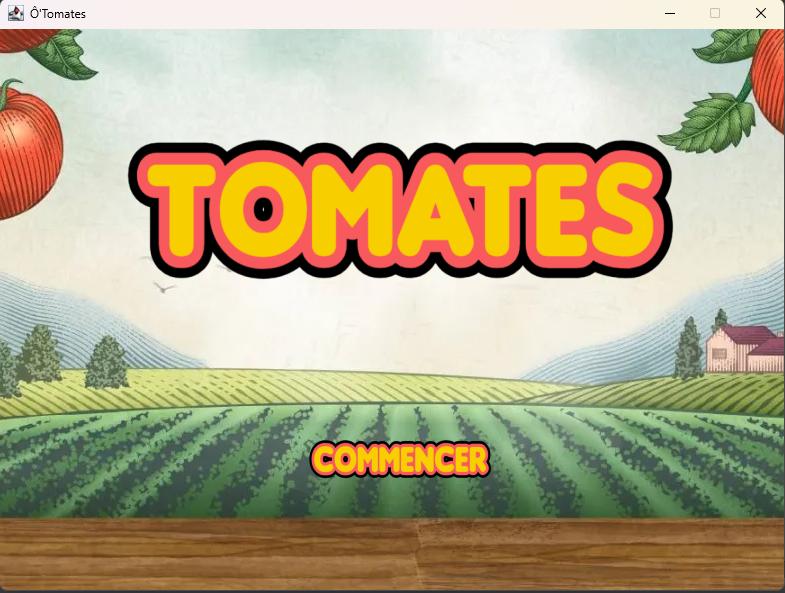
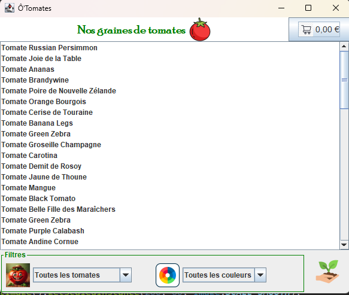
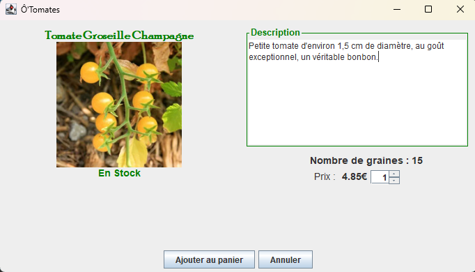
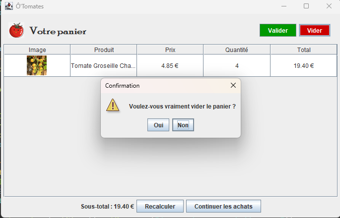
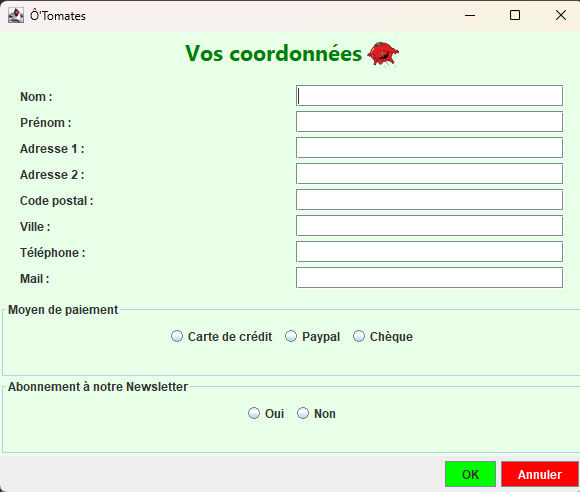
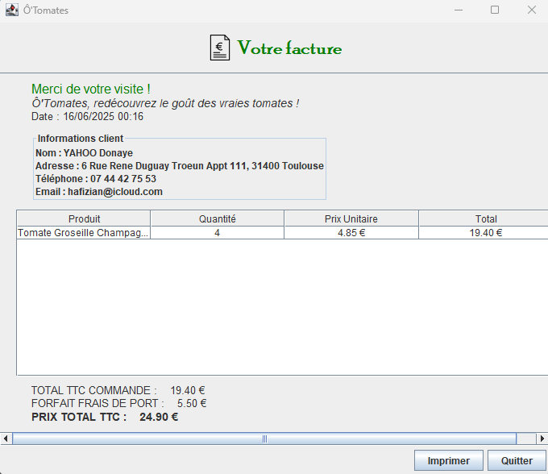
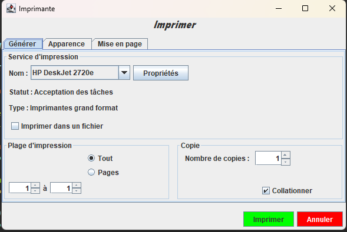
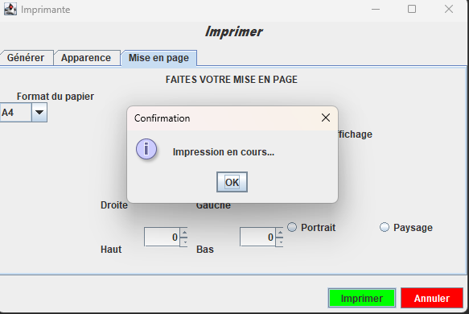

# 🍅 S201 Tomates — Java Swing Shop

A playful Java Swing application for browsing delicious tomato varieties, adding them to a cart, and persisting stock changes to JSON. Built with love for tomatoes and clean code.

## 🌟 Highlights
- Rich catalog and detail views for tomato varieties
- Shopping cart with quantity editing and totals
- Stock-aware UI: clamps quantities, disables actions when out-of-stock
- JSON persistence: live stock updates saved to `src/main/resources/data/tomatesSauvegarde.json`
- Fallback loading: prefers sauvegarde file if present, else defaults to `tomates.json`

## 🗂 Table of Contents
- Overview
- Highlights
- Quick Start
- App Flow
- Stock Persistence
- Key Classes
- Screens & Assets
- Screenshots
- Notes & Recommendations
- Verifying Behavior
- Fun Tomato Facts
- Contributing
- Project Structure

## 🚀 Quick Start
- Requirements: `Java 1.8` and an IDE (IntelliJ/Eclipse/VS Code) recommended
- Run from IDE:
  - Open the project
  - Launch `ihm.PageGarde#main` to start the app
- Build with Maven (optional):
  - `mvn -q -DskipTests=true compile`
  - Note: If Maven isn’t installed, running from IDE is easiest

## 🧭 App Flow
1. Open the catalog and choose a tomato variety
2. From the detail page, set quantity and click "Ajouter au panier"
3. Stock decrements immediately and persists to `tomatesSauvegarde.json`
4. In the cart, adjust quantities; stock syncs and persists on every change

## 🧺 Stock Persistence
- Save path: `src/main/resources/data/tomatesSauvegarde.json`
- Default dataset: `src/main/resources/data/tomates.json` (used if save file missing)
- Helper: `modèle.OutilsBaseDonneesTomates#mettreAJourStockTomateDansJson(String chemin, Tomate tomate)`
- Behavior:
  - If `tomatesSauvegarde.json` does not exist, it is initialized from `tomates.json`
  - The tomato’s `stock` field is updated based on cart actions

Example JSON entry:
```json
[
  {
    "désignation": "Tomate cœur de bœuf",
    "stock": 12,
    "prix": 2.50,
    "couleur": "rouge"
  }
]
```

## 🧩 Key Classes
- `ihm.PageGarde`: Entry point (main window)
- `ihm.ListeTomates`: Catalog list; loads from sauvegarde or default JSON
- `ihm.DetailUnTomate`: Detail view; handles add-to-cart and stock/UI updates
- `ihm.Panier`: Cart UI with editable quantities and automatic recalculations
- `service.PanierService`: Cart logic; syncs quantities with stock and persists
- `service.StockService`: Stock checks and adjustments
- `modèle.OutilsBaseDonneesTomates`: JSON read/write utilities

## 🎨 Screens & Assets
- App icon and images reside under `src/main/resources/`
- Example icon path: `src/main/resources/images/TOMATESICON.png`

## 📷 Screenshots

### Intro


### Lists


### Description


### Panier


### Coordonnées


### Facturation


### Impression


### Progression


## ⚠️ Notes & Recommendations
- Writing to classpath resources is fine in dev; for production, prefer a writable external path (e.g., `%APPDATA%/S201_TOMATES/tomatesSauvegarde.json`)
- If you want to reset the app to default stock, delete `tomatesSauvegarde.json` and restart

## 🧪 Verifying Behavior
- Add items to cart and confirm UI quantity clamps to available stock
- Reduce quantities in the cart and confirm stock returns to inventory
- Inspect `src/main/resources/data/tomatesSauvegarde.json` for updated `stock`
- Restart app; it should load from the sauvegarde file with persisted stock

## 🌱 Fun Tomato Facts
- Tomatoes are botanically fruits, culinarily vegetables — a delicious paradox!
- The French word for tomato is "tomate"; our app says bonjour to both 🍅 and 👩‍🌾
- Heirloom varieties come in red, yellow, green, even striped — just like our UI labels

## 🤝 Contributing
- Fork the repo, make your changes, and open a PR
- Ideas welcome: externalized persistence path, Maven exec plugin, tests

## 📜 Project Structure
```
S201_TOMATES/
├── pom.xml
├── src/
│   ├── main/
│   │   ├── java/   # app source (ihm, service, modèle)
│   │   └── resources/
│   │       └── data/
│   │           ├── tomates.json              # default dataset
│   │           └── tomatesSauvegarde.json    # persisted stock
│   └── test/
```

Merci et bon appétit de code! 🍅